## Ocular Disorders Detection with Deep Learning Approach Using Optical Coherence Tomography (OCT) Images

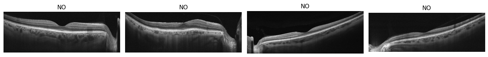
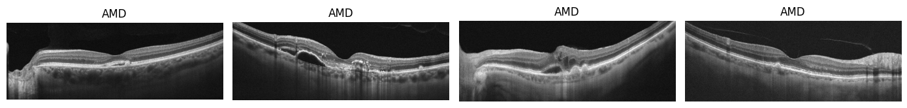
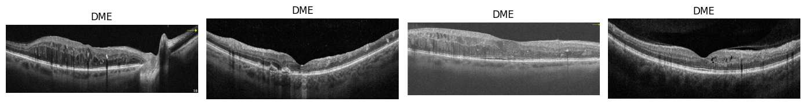
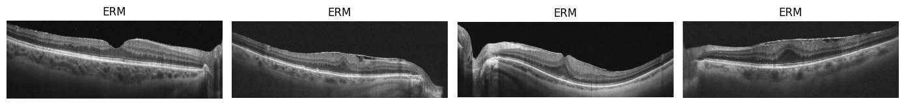

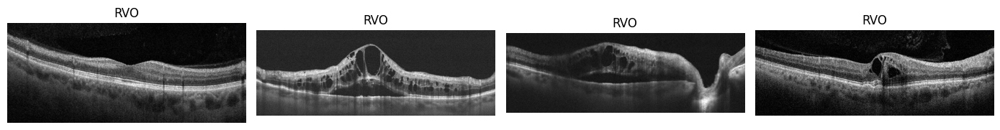
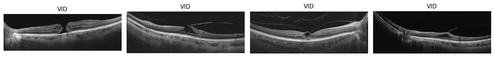

### Repo Directory
---

```
CNN_Ocular_Disorders_OCT/
├── data/
│   ├── oct_test.csv
│   └── oct_train.csv
│   └── oct_val.csv
|   └── OCTDL_labels.csv
├── learning_history/
|   ├── oct_enetv2m_sp_151124.csv
|   └── oct_enetv2m_sp_cw_151124.csv
├── notebooks/
|   ├── OCT_Data Splitting.ipynb
|   └── OCT_EfficientNetV2M_SP_151124.ipynb
|   └── OCT_EfficientNetV2M_SP_CW_151124.ipynb
|   └── OCT_ModelComparison.ipynb
├── models.md
├── README.md
└── requirements.txt
```

### Background
---

<p>
Optical Coherence Tomography (OCT) and fundus photography are pivotal non-invasive imaging techniques utilized for the detection and monitoring of various ocular conditions. OCT employs light waves to capture high-resolution cross-sectional images of the retina, enabling detailed examination of its layers<sup>1</sup>. The application of OCT in diagnosing ocular disorders such as glaucoma<sup>2</sup>, diabetic retinopathy<sup>3</sup>, and age-related macular degeneration (AMD)<sup>4</sup> has been extensively documented, highlighting its significance in clinical ophthalmology.
<br>
<br>
Both OCT and fundus images have been instrumental in training deep neural networks for developing computer-aided diagnostic systems. Numerous datasets, including both open-access and limited-access collections, exist for these imaging modalities<sup>5,6</sup>. The Kermany dataset<sup>7</sup> is recognized as one of the most comprehensive collections of OCT images available. Additionally, Yoo et al. (2020) previously shared an open-access dataset that is now the second largest publicly available collection of OCT images, comprising 2,064 images across seven ocular conditions, including normal retinal images. However, this dataset presents a significant class imbalance; AMD constitutes the majority with 1,231 images, while retinal artery occlusion (RAO) is represented by only 22 images.
<br>
<br>
While deep learning models can exhibit robustness against class imbalances, they are not entirely immune to its effects. Consequently, specific techniques may be necessary to enhance model performance in such scenarios. The objective of this project is to fine-tune a pre-trained model, EfficientNet, while exploring the efficacy of adjusting class weights to address class imbalance issues.
</p>


### Dataset
--- 

<p>
The OCTDL dataset utilized in this project is accessible via Mendeley and comprises a total of 2,064 OCT images stored in JPG format. These images are organized into separate folders corresponding to specific disease labels. The dataset includes macular raster scans for several ocular conditions, including Age-related Macular Degeneration (AMD), Diabetic Macular Edema (DME), Epiretinal Membrane (ERM), Retinal Artery Occlusion (RAO), Retinal Vein Occlusion (RVO), and Vitreomacular Interface Disease (VID). Additionally, it features various pathological conditions such as Macular Neovascular Membranes (MNV), Disorganization of Retinal Inner Layers (DRIL), drusen, Macular Edema (ME), and Macular Hole (MH).
<br>
<br>
For model development, data splitting was performed following the methodology outlined by Kulyabin et al. (2024). The dataset was randomly divided into training, validation, and test subsets in a ratio of 70:10:20 at the patient level. This approach ensures that images from a single patient are exclusively allocated to one of the subsets, thereby preventing data leakage and promoting the robustness of the model evaluation. Used data is available at the following link and can be accessed for free: <a href="https://data.mendeley.com/datasets/btv6yrdbmv/1">https://data.mendeley.com/datasets/btv6yrdbmv/1</a>

| Disorder                             | Label | Number of OCT Images | Number of Patients |
|--------------------------------------|-------|----------------------|--------------------|
| Age-related Macular Degeneration     | AMD   | 1231                 | 421                |
| Diabetic Macular Edema               | DME   | 147                  | 107                |
| Epiretinal Membrane                  | ERM   | 155                  | 71                 |
| Normal                               | NO    | 332                  | 110                |
| Retinal Artery Occlusion             | RAO   | 22                   | 11                 |
| Retinal Vein Occlusion               | RVO   | 101                  | 50                 |
| Vitreomacular Interface Disease      | VID   | 76                   | 51                 |
| **Total**                            |       | **2064**             | **821**            |

<i>Table 1. Class distribution of OCTDL dataset.</i>


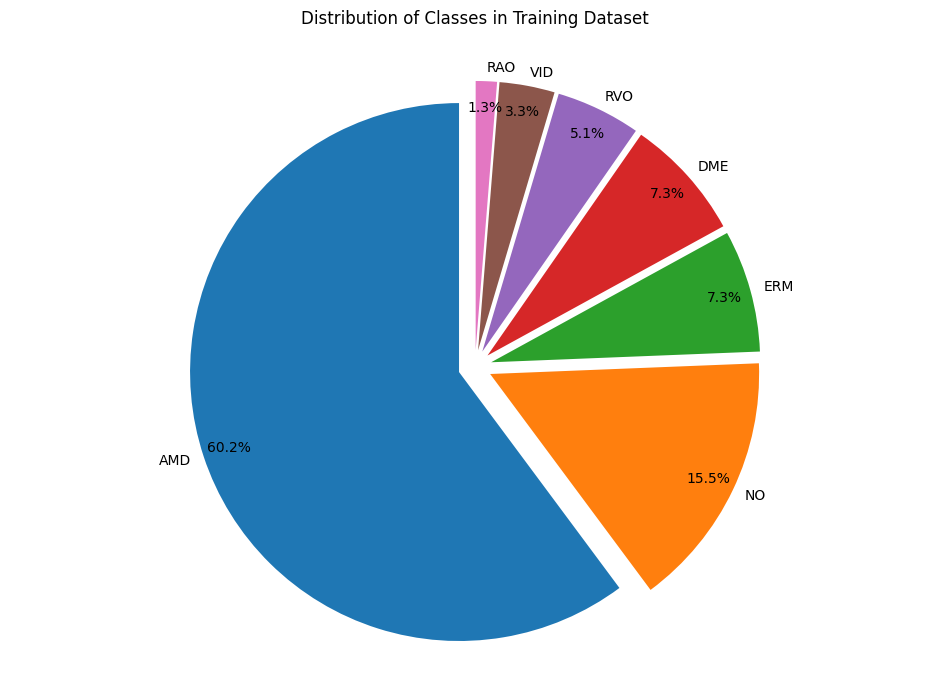
<i>Figure 1. Proportion of each ocular conditions in the dataset.</i>

</p>

### Data Preprocessing
---

<p>
All images were rescaled to a pixel intensity range of 0 to 1 to normalize the input data. To enhance the diversity of the training dataset and prevent overfitting, data augmentation techniques were applied. The augmentation strategies included random rotations up to 0.2 radians, width and height shifts of up to 10%, zoom adjustments within a 0.2 range, as well as horizontal and vertical flips. These techniques were implemented to improve the model’s ability to generalize across variations in the input data.
</p>


### Results
---

<p>
Yoo et al. (2020) previously trained their models using two pre-trained architectures, VGG16 and ResNet50, on the OCTDL dataset, achieving a class-wise balanced accuracy of 0.979 across all categories. Given the significant class imbalance present in the dataset, this project aims to leverage class weight adjustment while fine-tuning models with a different architecture. Specifically, two models were fine-tuned using the EfficientNetV2 architecture. Both models were trained from the EfficientNetV2 base, with one model incorporating class weight adjustments during training. In this approach, higher weights were assigned to the minority classes to mitigate the effects of class imbalance.
</p>

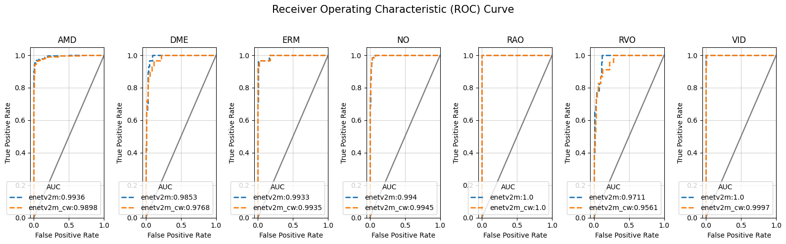
<i>Figure 2. Receiver Operating Characteristic (ROC) curves.</i>

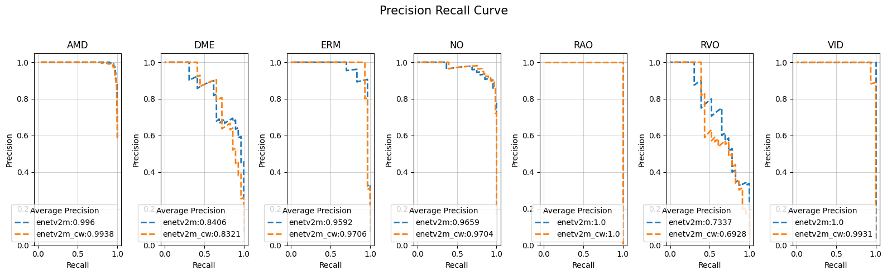
<i>Figure 3. Precision recall curves.</i>

| Class | Model    | Precision | Recall  | F1-Score | AUC    | Average Precision |
|-------|----------|-----------|---------|----------|--------|-------------------|
| AMD   | Model 1  | 0.9705    | 0.9664  | 0.9684   | 0.9936 | 0.9960            |
|       | Model 2  | 0.9745    | 0.9622  | 0.9683   | 0.9898 | 0.9938            |
| DME   | Model 1  | 0.6452    | 0.6897  | 0.6667   | 0.9853 | 0.8406            |
|       | Model 2  | 0.7241    | 0.7241  | 0.7241   | 0.9768 | 0.8321            |
| ERM   | Model 1  | 0.8286    | 0.9667  | 0.8923   | 0.9933 | 0.9592            |
|       | Model 2  | 0.7778    | 0.9333  | 0.8485   | 0.9935 | 0.9706            |
| NO    | Model 1  | 0.8767    | 0.9412  | 0.9078   | 0.9940 | 0.9659            |
|       | Model 2  | 0.9231    | 0.8824  | 0.9023   | 0.9945 | 0.9704            |
| RAO   | Model 1  | 1.0000    | 1.0000  | 1.0000   | 1.0000 | 1.0000            |
|       | Model 2  | 0.7500    | 1.0000  | 0.8571   | 1.0000 | 1.0000            |
| RVO   | Model 1  | 0.7500    | 0.3913  | 0.5143   | 0.9711 | 0.7337            |
|       | Model 2  | 0.5789    | 0.4783  | 0.5238   | 0.9561 | 0.6928            |
| VID   | Model 1  | 0.9375    | 0.9375  | 0.9375   | 1.0000 | 1.0000            |
|       | Model 2  | 0.8421    | 1.0000  | 0.9143   | 0.9997 | 0.9931            |

<i>Table 2. Resulting metrics of Model 1 (without class weight adjustment) and Model 2 (with class weight adjustment) on OCTDL dataset.</i>

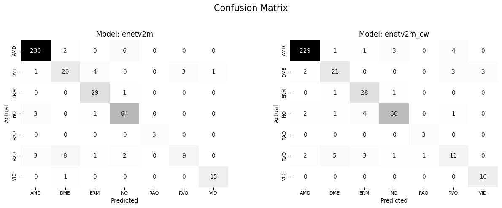
<i>Figure 4. Confusion matrices of models fine-tuned using EfficientNetv2 architecture, Model 1 (without class weight adjusted) and Model 2 (with class weight adjusted), trained on OCTDL dataset.</i>

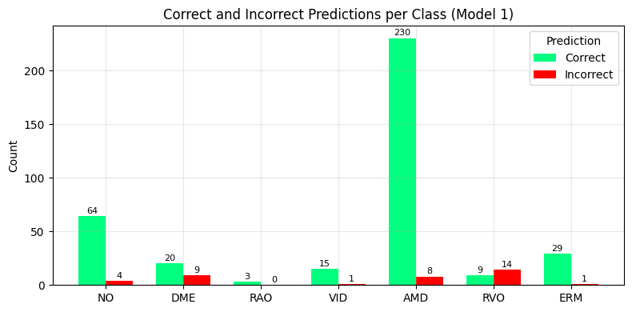
<i>Figure 5. Correct and incorrect predictions for each class by Model 1.</i>

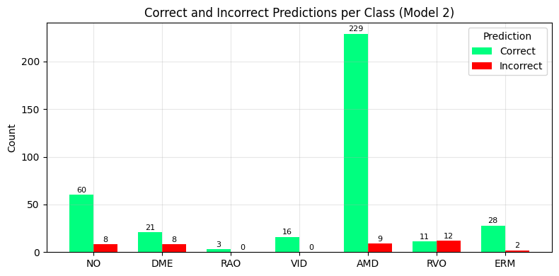
<i>Figure 6. Correct and incorrect predictions for each class by Model 2.</i>

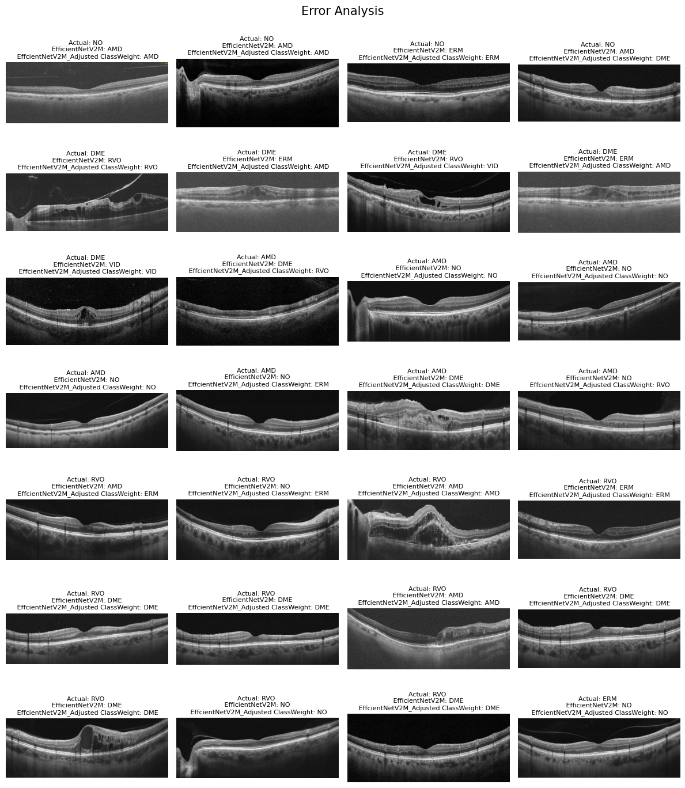
<i>Figure 7. Images failed to classify by both models</i>

### Future Directions
---

1. **Addressing Class Imbalance.** Exploring other techniques such as oversampling and undersampling be applied to enhance the model's ability to generalize and improve overall performance. These methods may help mitigate the effects of class imbalance in the dataset, leading to more robust predictions across all classes.

2. **Exploring Different Network Architectures.** Investigating the use of pre-trained Vision Transformer (ViT) models could be beneficial for assessing their performance, particularly concerning minority classes. Given their unique architecture and attention mechanisms, ViTs may offer improved feature extraction and classification capabilities compared to traditional CNNs.

3. **Image Enhancement Techniques.** Recent work by Elkholy et al. (2024) indicates that image enhancement techniques—including brightness and contrast adjustments, as well as smoothing methods to reduce blur and noise—can significantly improve model performance. Their findings suggest that these enhancements achieved accuracy levels surpassing those reported in previous literature using the Kermany OCT dataset. Exploring similar image enhancement strategies may provide valuable insights for future research.


### References
---

1. [Optical Coherence Tomography (OCT) and Fundus Photography.](https://www.oscarwylee.com.au/glasses/eye/oct-fundus-test?srsltid=AfmBOoqtsC5Dn1sNvNc88jzjnj21SL3oKIPKYHzEMbCqiddTlfRNFmLx)
2. [Geevarghese, A., Wollstein, G., Ishikawa, H., & Schuman, J. S. (2021). Optical Coherence Tomography and Glaucoma. Annual review of vision science, 7, 693–726.](https://pubmed.ncbi.nlm.nih.gov/34242054/)
3. [Amoaku, W. M., Ghanchi, F., Bailey, C., Banerjee, S., Banerjee, S., Downey, L., Gale, R., Hamilton, R., Khunti, K., Posner, E., Quhill, F., Robinson, S., Setty, R., Sim, D., Varma, D., & Mehta, H. (2020). Diabetic retinopathy and diabetic macular oedema pathways and management: UK Consensus Working Group. Eye (London, England), 34(Suppl 1), 1–51.](https://pubmed.ncbi.nlm.nih.gov/32504038/)
4. [Flores, R., Carneiro, Â., Tenreiro, S., & Seabra, M. C. (2021). Retinal Progression Biomarkers of Early and Intermediate Age-Related Macular Degeneration. Life (Basel, Switzerland), 12(1), 36.](https://pubmed.ncbi.nlm.nih.gov/35054429/)
5. https://pmc.ncbi.nlm.nih.gov/articles/PMC11009408/#CR8"></a>
6. [Kulyabin, M., Zhdanov, A., Nikiforova, A., Stepichev, A., Kuznetsova, A., Ronkin, M., Borisov, V., Bogachev, A., Korotkich, S., Constable, P. A., & Maier, A. (2024). OCTDL: Optical Coherence Tomography Dataset for Image-Based Deep Learning Methods. Scientific data, 11(1), 365.](https://pubmed.ncbi.nlm.nih.gov/37240693/)
7. [Kermany, Daniel; Zhang, Kang; Goldbaum, Michael (2018), “Labeled Optical Coherence Tomography (OCT) and Chest X-Ray Images for Classification”, Mendeley Data, V2.](https://data.mendeley.com/datasets/rscbjbr9sj/2)
8. [Yoo, TaeKeun (2020), “Data for: Improved accuracy in OCT diagnosis of rare retinal disease using few-shot learning with generative adversarial networks”, Mendeley Data, V1.](https://data.mendeley.com/datasets/rscbjbr9sj/2)
9. [Elkholy, M., & Marzouk, M. A. (2024). Deep learning-based classification of eye diseases using Convolutional Neural Network for OCT images. Frontiers in Computer Science, 5, 1252295.](https://www.frontiersin.org/journals/computer-science/articles/10.3389/fcomp.2023.1252295/full)
