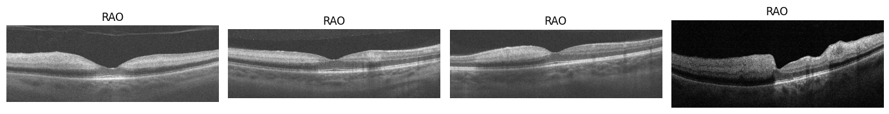
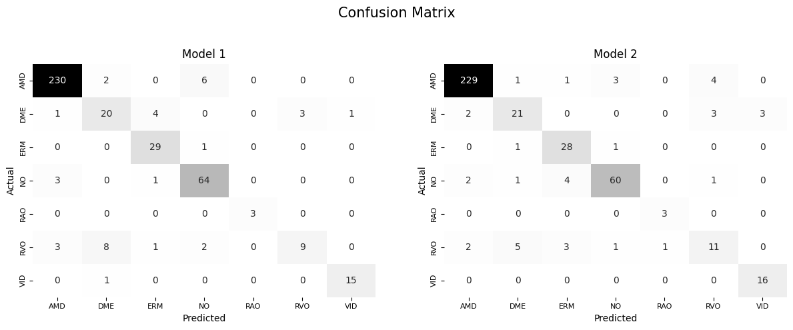

## Ocular Disorders Detection with Deep Learning Approach Using Optical Coherence Tomography (OCT) Images





### Repo Directory
---

```

```

### Background
---

<p>
Optical Coherence Tomography (OCT) and fundus photography are pivotal non-invasive imaging techniques utilized for the detection and monitoring of various ocular conditions. OCT employs light waves to capture high-resolution cross-sectional images of the retina, enabling detailed examination of its layers<sup>1</sup>. The application of OCT in diagnosing ocular disorders such as glaucoma<sup>2</sup>, diabetic retinopathy<sup>3</sup>, and age-related macular degeneration (AMD)<sup>4</sup> has been extensively documented, highlighting its significance in clinical ophthalmology.
<br>
Both OCT and fundus images have been instrumental in training deep neural networks for developing computer-aided diagnostic systems. Numerous datasets, including both open-access and limited-access collections, exist for these imaging modalities<sup>5,6</sup>. The Kermany dataset<sup>7</sup> is recognized as one of the most comprehensive collections of OCT images available. Additionally, Yoo et al. (2020) previously shared an open-access dataset that is now the second largest publicly available collection of OCT images, comprising 2,064 images across seven ocular conditions, including normal retinal images. However, this dataset presents a significant class imbalance; AMD constitutes the majority with 1,231 images, while retinal artery occlusion (RAO) is represented by only 22 images.
<br>
While deep learning models can exhibit robustness against class imbalances, they are not entirely immune to its effects. Consequently, specific techniques may be necessary to enhance model performance in such scenarios. The objective of this project is to fine-tune a pre-trained model, EfficientNet, while exploring the efficacy of adjusting class weights to address class imbalance issues.
</p>


### Dataset
--- 

<p>
The OCTDL dataset utilized in this project is accessible via Mendeley and comprises a total of 2,064 OCT images stored in JPG format. These images are organized into separate folders corresponding to specific disease labels. The dataset includes macular raster scans for several ocular conditions, including Age-related Macular Degeneration (AMD), Diabetic Macular Edema (DME), Epiretinal Membrane (ERM), Retinal Artery Occlusion (RAO), Retinal Vein Occlusion (RVO), and Vitreomacular Interface Disease (VID). Additionally, it features various pathological conditions such as Macular Neovascular Membranes (MNV), Disorganization of Retinal Inner Layers (DRIL), drusen, Macular Edema (ME), and Macular Hole (MH).
<br>
For model development, data splitting was performed following the methodology outlined by Kulyabin et al. (2024). The dataset was randomly divided into training, validation, and test subsets in a ratio of 70:10:20 at the patient level. This approach ensures that images from a single patient are exclusively allocated to one of the subsets, thereby preventing data leakage and promoting the robustness of the model evaluation. Used data is available at the following link and can be accessed for free: <a href="https://data.mendeley.com/datasets/btv6yrdbmv/1">https://data.mendeley.com/datasets/btv6yrdbmv/1</a>


<i>Figure 1. Proportion of each ocular conditions in the dataset.</i>

</p>

### Data Preprocessing
---

<p>
All images were rescaled to a pixel intensity range of 0 to 1 to normalize the input data. To enhance the diversity of the training dataset and prevent overfitting, data augmentation techniques were applied. The augmentation strategies included random rotations up to 0.3 radians, width and height shifts of up to 10%, zoom adjustments within a 0.1 range, as well as horizontal and vertical flips. These techniques were implemented to improve the model’s ability to generalize across variations in the input data.
</p>


### Results
---


<i>Figure . Confusion matrix.</i>


### References
---
<p>
1.	<a href="https://www.oscarwylee.com.au/glasses/eye/oct-fundus-test?srsltid=AfmBOoqtsC5Dn1sNvNc88jzjnj21SL3oKIPKYHzEMbCqiddTlfRNFmLx">Optical Coherence Tomography (OCT) and Fundus Photography.</a>
2.	<a href="https://pubmed.ncbi.nlm.nih.gov/34242054/">Geevarghese, A., Wollstein, G., Ishikawa, H., & Schuman, J. S. (2021). Optical Coherence Tomography and Glaucoma. Annual review of vision science, 7, 693–726.</a>
3.	<a href="https://pubmed.ncbi.nlm.nih.gov/32504038/">Amoaku, W. M., Ghanchi, F., Bailey, C., Banerjee, S., Banerjee, S., Downey, L., Gale, R., Hamilton, R., Khunti, K., Posner, E., Quhill, F., Robinson, S., Setty, R., Sim, D., Varma, D., & Mehta, H. (2020). Diabetic retinopathy and diabetic macular oedema pathways and management: UK Consensus Working Group. Eye (London, England), 34(Suppl 1), 1–51.</a>
4.	<a href="https://pubmed.ncbi.nlm.nih.gov/35054429/">Flores, R., Carneiro, Â., Tenreiro, S., & Seabra, M. C. (2021). Retinal Progression Biomarkers of Early and Intermediate Age-Related Macular Degeneration. Life (Basel, Switzerland), 12(1), 36.</a>
5.	<a href="https://pmc.ncbi.nlm.nih.gov/articles/PMC11009408/#CR8">Kulyabin, M., Zhdanov, A., Nikiforova, A., Stepichev, A., Kuznetsova, A., Ronkin, M., Borisov, V., Bogachev, A., Korotkich, S., Constable, P. A., & Maier, A. (2024). OCTDL: Optical Coherence Tomography Dataset for Image-Based Deep Learning Methods. Scientific data, 11(1), 365.</a>
6.	<a href="https://pubmed.ncbi.nlm.nih.gov/37240693/">Krzywicki, T., Brona, P., Zbrzezny, A. M., & Grzybowski, A. E. (2023). A Global Review of Publicly Available Datasets Containing Fundus Images: Characteristics, Barriers to Access, Usability, and Generalizability. Journal of clinical medicine, 12(10), 3587.</a>
7.	<a href="https://data.mendeley.com/datasets/rscbjbr9sj/2">Kermany, Daniel; Zhang, Kang; Goldbaum, Michael (2018), “Labeled Optical Coherence Tomography (OCT) and Chest X-Ray Images for Classification”, Mendeley Data, V2.</a>
8.	<a href="https://data.mendeley.com/datasets/rscbjbr9sj/2">Yoo, TaeKeun (2020), “Data for: Improved accuracy in OCT diagnosis of rare retinal disease using few-shot learning with generative adversarial networks”, Mendeley Data, V1.</a>
</p>